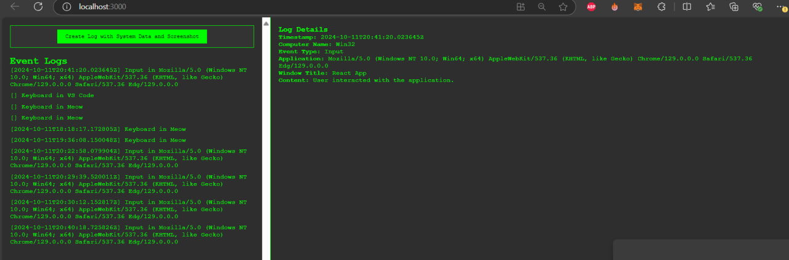

# Создано Frontend с использование фрейморвка React и библиотек axios и html2canvas

Страница разделена на две части, в первой части, вывод всех логов  
и обращение к endpoint'у /logs/  
Также есть кнопка которая генерирует log из информации системы и делает скриншот страницы.  
И отправляет на /logs/content/create/  

Второй части после скороллбара, меню детального отображения log'a со скриншотом  

### P.S
Обычно использую tailwind или boostrap, но псольку в информации о вакансии, у вас написано  
о надобносьти чистого html и css, то было решение написат .css файлы дял демонстрации навыков  
Также ради красоты добавил анимашку печати.  
## Запуск приложения
1. npm install -  для установки зависимостей из package.json  
2. npm start - для запуска приложения на localhost на порту 3000  
**Внимание!!!!!**  
у вас должен быть установлен node.js для запуска

**P.P.S**
В проекте осталось чуток мусора от стандартной конфигруации react в /public  
надеюсь, не очень страшно, что забыл удалить

